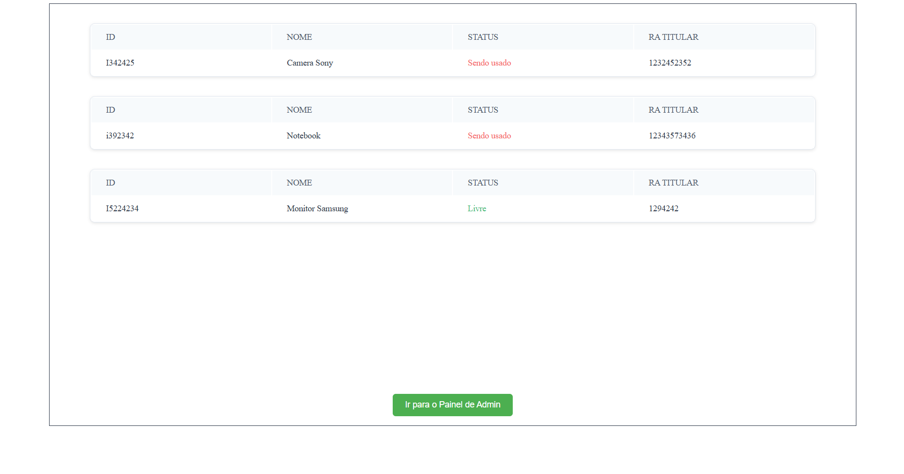

<h1>CRUD EM DJANGO UTILIZANDO ADMIN</h1>
 Realize um CRUD com equipamentos;

<h2>Acesse com o login</h2>
 <h3>testeLobianco</h3>  
 
<h2>Senha</h2>
  <h3>teste12345678</h3>
    
Integrantes:  Arthur Selingin,  Ana Paula,  Enzo Tanizaki,  Guilherme Direnzi,  Victor Coriolano
  
py version = 3.13

Page:
